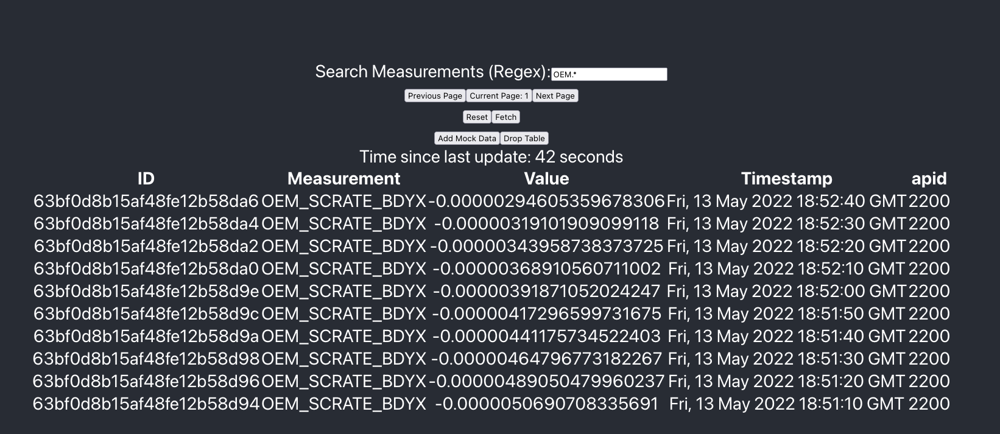

# Measurement App

This simple app stores measurement data with MongoDB, serves data with Flask (Python) and displays data for users in a ReactJS Frontend.

# Quickstart

## Requirements
* Docker [install instructions](https://docs.docker.com/get-docker/)
* Docker-compose [install with pip](https://pypi.org/project/docker-compose/)

From the project root directory, run simply with 1 command
```
docker-compose up
```

In a few minutes, 3 containers will be built: Python Backend, MongoDB, and Node Frontend.

After building, containers may need a few moments to initialize some data. NOTE: As designed, a index must be created by running [db_indexes.py](backend/modules/scripts/db_indexes.py). Skipping this should not break basic demo functionality.

Access the frontend at [http://localhost:3000](http://localhost:3000). Backend runs at [http://localhost:5000](http://localhost:5000). Mongo runs on port 27017.

Full service definition is at [docker-compose.yml](docker-compose.yml).

# Demo

